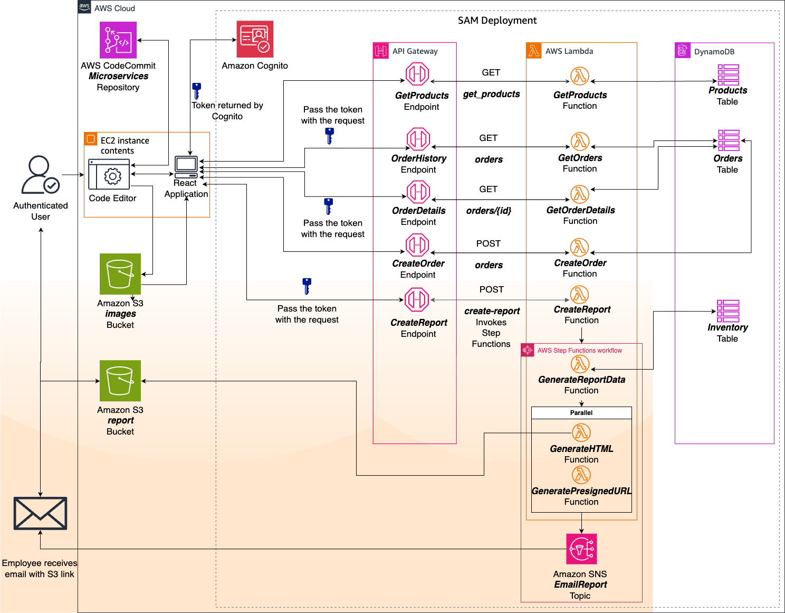

<div align="center">

# AnyCompany-Bicycle-Shop-Microservices

### Refactoring a Django Bicycle Parts Monolith into a React + AWS Serverless Microservices Architecture

<p align="center">
  
  
  
  
  
</p>

<p align="center">
  
  
  
  
  
</p>

<p align="center">
  <b>Current Phase:</b> Phase 6 package validated with Cognito-protected employee workflows, inventory report generation, Step Functions orchestration, presigned URL S3 link delivery, and SNS email notification
</p>

</div>

---

## Overview

This project focuses on refactoring the **AnyCompany Bicycle Parts application** from a Django monolith into a **React + AWS serverless microservices architecture**.

The project starts from an existing Django ecommerce application and follows a phased sprint sequence centered on frontend modernization, service decomposition, serverless API development, DynamoDB-backed service data, and AWS deployment readiness.

At the current stage, this repository functions as the **documentation and packaged-deliverable record** for the microservices project. Phases 1 through 6 are preserved as archived zip packages under `docs/phase-zips/`.

> **Schedule note:** Phases 1-4 were completed during one accelerated project week. Phase 5 is tracked as the authentication and authorization milestone in Week 2, and Phase 6 is tracked as the near-final reporting workflow milestone in Week 3.

---

## Repository Description

AWS Cloud Institute project repository for documenting project progress, storing architecture assets, and maintaining packaged application snapshots for the AnyCompany Bicycle Parts microservices refactor.

---

## Client Scenario

**AnyCompany Bicycle Parts** has an existing Django web application that supports product listing, order submission, order lookup, and low-inventory reporting.

The existing monolith stores Products, Orders, Order Items, and Inventory in a single relational database and deploys the application as one tightly coupled unit. This project modernizes that baseline by introducing a React frontend, AWS serverless service boundaries, API Gateway routes, Lambda handlers, DynamoDB tables, and S3-hosted assets.

Original monolith reference: https://github.com/Levi-Breedlove/AnyCompany-Bicycle-Shop

---

## Current Status

| Category | Current State |
|----------|---------------|
| Project Status | Near Final |
| Timeline | Accelerated multi-phase microservices build |
| Repository Type | Documentation and packaged phase artifacts |
| Deployment Target | Locally run React frontend with personal-account AWS serverless microservices |
| Application Type | React frontend with preserved Django baseline and AWS serverless backend packages |
| Current Focus | Phase 6 validated: authenticated employee report creation, Inventory table support, Step Functions report orchestration, report HTML generation, presigned URL S3 link delivery, SNS email notification, and near-final architecture documentation |

---

## Near-Final Architecture Diagram

This project uses an AWS microservices design for refactoring the AnyCompany Bicycle Parts application. The README architecture asset has been refreshed from `docs/images/bicycle-parts-microservices-architecture2.png` into the canonical diagram path below.

<p align="center">
  
</p>

**Architecture flow**  
`React UI -> Amazon Cognito employee login -> Amazon API Gateway -> AWS Lambda microservices -> Amazon DynamoDB service-owned tables`

**Reporting flow**
`Authenticated employee -> POST /create-report -> AWS Step Functions -> report Lambda functions -> Amazon S3 report object -> Amazon SNS email with presigned URL S3 link`

The Phase 6 package keeps the product catalog, order submission, employee order reads, and Cognito-backed employee access model while adding an authenticated inventory-report workflow. The preserved Django monolith remains available in Phase 1 for comparison and decomposition reference.

---

## Platform and Tooling

<table>
  <tr>
    <td valign="top" width="50%">

### AWS Services

| Service | Purpose |
|---------|---------|
| Amazon S3 | Stores SAM deployment artifacts, frontend image assets, generated report HTML, and report objects reached through presigned URL S3 links |
| Amazon API Gateway | REST API entry point for catalog, order, and employee reporting routes |
| API Gateway Cognito Authorizer | Protects employee-only order and report routes with Cognito-issued tokens |
| AWS Lambda | Runs Products, Orders, and report workflow handlers |
| Amazon DynamoDB | Stores Products, Orders, and Inventory service data |
| Amazon Cognito | Provides employee sign-in, hosted authentication flow, user pool client, and token issuance |
| AWS Step Functions | Orchestrates inventory report data generation, HTML generation, presigned URL creation, and SNS notification |
| Amazon SNS | Sends employee report notification email with the presigned URL S3 link |
| AWS SAM | Defines and packages the serverless application for repeatable deployment |
| AWS CloudFormation | Provisions API Gateway, Lambda, DynamoDB, Cognito, Step Functions, SNS, and related stack resources |
| IAM | Provides deployer, runtime, and service permissions for the serverless workflow |
| Amazon CloudWatch Logs | Captures Lambda runtime logs for troubleshooting and validation |
| AWS CodeCommit | Optional AWS-hosted source-control target for the microservices handoff |

  </td>
  <td valign="top" width="50%">

### Tech Stack

| Layer | Tools / Services |
|-------|------------------|
| Frontend Application | React, Vite, JavaScript, React Router, Axios |
| Frontend Assets | Local `public/images/` assets with optional S3-backed image URLs |
| Backend Baseline | Python, Django monolith preserved for comparison and decomposition reference |
| Serverless Backend | Python 3.12 Lambda handlers, boto3, AWS SAM template resources |
| Data and Seed Utilities | JSON seed files plus Python utilities for Products, Orders, Inventory, images, and report bucket setup |
| Report Workflow | Step Functions state machine, report data Lambda, HTML generation Lambda, presigned URL Lambda, SNS publish task |
| Authentication | Cognito hosted employee login, token storage in the React app, bearer-token API requests |
| Deployment Tools | AWS CLI, SAM CLI, CloudFormation stack deployment, account-specific environment variables |
| Source Control | Git, GitHub, optional AWS CodeCommit |
| Testing | Vitest, React Testing Library, SAM starter tests, Python unit/integration test scaffolding |
| Code Quality | ESLint for the React app, Python linting conventions from earlier phase packages |
| Packaging and Validation | Zip phase archives, `unzip` integrity checks, README package inventory, architecture PNG assets |
| Documentation | Markdown README, architecture diagrams, interim AWS setup notes, and phase validation notes |

  </td>
  </tr>
</table>

---

## Project Scope and What This Capstone Demonstrates

This capstone-style project takes an existing Django bicycle parts ecommerce application through a phased microservices refactor into a React + AWS serverless architecture. It builds practical experience across frontend modernization, service decomposition, API design, AWS service integration, authentication, report orchestration, test validation, cost-aware deployment planning, and packaged sprint delivery.

Through the completed phase sequence, this project demonstrates:

- working from an existing Django monolith
- preserving a baseline application snapshot for future comparison
- creating a React/Vite frontend foundation
- replacing static catalog data with a DynamoDB-backed Products API
- adding order history, order detail, and order creation workflows
- deploying service APIs through AWS SAM, API Gateway, Lambda, and DynamoDB
- serving bundled frontend image assets locally with optional S3-backed image URLs
- adding Cognito employee authentication and API Gateway token authorization
- validating cart contents and catalog pricing inside Lambda before persisting orders
- adding an employee-triggered inventory report workflow with Step Functions, Lambda report generation, S3 report storage, presigned URL S3 link delivery, and SNS email notification
- documenting personal-account AWS deployment prerequisites, IAM roles, policies, environment values, smoke tests, troubleshooting, and cleanup steps
- applying personal-account cost controls for DynamoDB capacity, logs, Cognito, API throttling, and tagged resources
- packaging phase deliverables as zip archives and validating archive contents before documenting them

---

## Phase Guide and Package Notes

This repository serves as the documentation and packaging layer for the microservices project rather than the live application source itself.

At this stage, the repository contains:

- project documentation
- architecture image assets used in the README
- packaged **Phase 1**, **Phase 2**, **Phase 3**, **Phase 4**, **Phase 5**, and **Phase 6** application snapshots under `docs/phase-zips/`
- interim personal AWS account setup notes inside earlier phase packages
- a validated Phase 6 archive with reporting workflow code and documented package caveats

The live React, Django, and serverless project files are preserved inside the archived packages and are not expanded into the root repository as active source code. Each zip package acts as a point-in-time snapshot that can be used for reference, backup, migration, deployment practice, or later extraction into a live working codebase.

### AWS Setup Notes and Validation Status

| Phase | Zip Package | Setup Notes Inside Zip |
|---|---|---|
| Phase 1 | `docs/phase-zips/phase-1-bicycle-shop-microservices.zip` | `AWS_SETUP_GUIDE.md` |
| Phase 2 | `docs/phase-zips/phase-2-bicycle-shop-microservices.zip` | `AWS_SETUP_GUIDE.md` |
| Phase 3 | `docs/phase-zips/phase-3-bicycle-shop-microservices.zip` | `microservices/AWS_SETUP_GUIDE.md` |
| Phase 4 | `docs/phase-zips/phase-4-bicycle-shop-microservices.zip` | `microservices/AWS_SETUP_GUIDE.md` |
| Phase 5 | `docs/phase-zips/phase-5-bicycle-shop-microservices.zip` | `microservices/AWS_SETUP_GUIDE.md` |
| Phase 6 | `docs/phase-zips/phase-6-bicycle-shop-microservices.zip` | Not present; validated absent. The archive contains starter READMEs at `microservices/bike-app/README.md` and `microservices/backend/sam-app/README.md`. |

The setup documentation is still evolving while the project has one remaining lab. Final end-to-end setup guides will be added at project completion so they reflect the full architecture, final IAM shape, deployment flow, smoke tests, troubleshooting notes, and cleanup steps in one consistent handoff.

---

## Repository Structure

```bash
.
|-- docs/
|   |-- images/
|   |   |-- bicycle-parts-microservices-architecture.png
|   |   `-- bicycle-parts-microservices-architecture2.png
|   `-- phase-zips/
|       |-- phase-1-bicycle-shop-microservices.zip
|       |-- phase-2-bicycle-shop-microservices.zip
|       |-- phase-3-bicycle-shop-microservices.zip
|       |-- phase-4-bicycle-shop-microservices.zip
|       |-- phase-5-bicycle-shop-microservices.zip
|       `-- phase-6-bicycle-shop-microservices.zip
`-- README.md
```

---

## Phase Package Contents

<details>
<summary><b>Phase 1 Package Contents</b></summary>

The archived Phase 1 package contains the React/Vite frontend foundation, the preserved Django monolith baseline, and supporting development files.

```bash
phase-1-bicycle-shop-microservices.zip
|-- AWS_SETUP_GUIDE.md                         # Personal AWS S3 frontend deployment guide
|-- .gitignore
|-- bikify.sh
|-- bike-app/                                  # React/Vite frontend foundation
|   |-- deployment.md
|   |-- package.json
|   |-- vite.config.js
|   |-- public/
|   `-- src/
`-- django/                                    # Preserved Django monolith baseline
    |-- bicycle_app/
    |-- bicycle_project/
    |-- media/
    |-- static/
    |-- deployment.md
    |-- local_build.sh
    |-- products.json
    |-- requirements.txt
    |-- requirements-dev.txt
    `-- setup.sh
```

### Structure Notes

- Establishes the frontend foundation and keeps the original Django monolith available for comparison.
- Includes local validation scripts for React and Django baseline work.
- Includes `AWS_SETUP_GUIDE.md` for personal-account S3 static hosting and clear notes that API Gateway, Lambda, DynamoDB, SAM, and CloudWatch Logs arrive in later phases.

</details>

<details>
<summary><b>Phase 2 Package Contents</b></summary>

The archived Phase 2 package introduces the Products microservice and connects the React product catalog to AWS serverless backend resources.

```bash
phase-2-bicycle-shop-microservices.zip
|-- AWS_SETUP_GUIDE.md                         # Personal AWS Products service deployment guide
|-- bike-app/                                  # React app configured for API Gateway and S3 image URLs
|   |-- .env.example
|   |-- package.json
|   |-- public/images/
|   `-- src/components/Products.jsx
|-- backend/
|   |-- sam-app/
|   |   |-- template.yaml                      # Products table, GetProducts Lambda, API route
|   |   |-- handlers/get_products/
|   |   `-- tests/
|   `-- utils/
|       |-- create_products/
|       `-- s3/
|-- products-django.json
|-- products-transformed.json
`-- create_images_bucket.py
```

### Structure Notes

- Adds a DynamoDB-backed `Products` table and `GET /get_products` Lambda endpoint through AWS SAM.
- Requires the personal AWS account to create the pre-existing `LambdaApplicationRoleSam` runtime role before deployment.
- Includes seed and S3 image bucket utilities. The AWS setup guide documents the manual S3 image upload step needed by this phase.

</details>

<details>
<summary><b>Phase 3 Package Contents</b></summary>

The archived Phase 3 package expands the serverless backend with order-history and order-detail read workflows.

```bash
phase-3-bicycle-shop-microservices.zip
`-- microservices/
    |-- AWS_SETUP_GUIDE.md                     # Personal AWS Products and Orders read deployment guide
    |-- bike-app/
    |   |-- .env.example
    |   |-- package.json
    |   |-- public/images/
    |   `-- src/components/
    |       |-- Products.jsx
    |       |-- OrderHistory.jsx
    |       `-- OrderDetails.jsx
    `-- backend/
        |-- sam-app/
        |   |-- template.yaml                  # Products, Orders, and read-only Lambda routes
        |   |-- handlers/get_products/
        |   |-- handlers/get_orders/
        |   `-- handlers/get_order/
        `-- utils/
            |-- create_products/
            |-- create_orders/
            `-- s3/
```

### Structure Notes

- Adds `Orders` table support plus `GET /orders` and `GET /orders/{order_id}` API routes.
- Keeps the pre-existing `LambdaApplicationRoleSam` dependency and documents the exact trust policy, CloudWatch Logs managed policy, and DynamoDB read permissions required.
- Includes sample order seed data and a personal AWS setup guide with Phase 3 smoke tests.

</details>

<details>
<summary><b>Phase 4 Package Contents</b></summary>

The archived Phase 4 package completes the first end-to-end customer order workflow.

```bash
phase-4-bicycle-shop-microservices.zip
`-- microservices/
    |-- AWS_SETUP_GUIDE.md                     # Personal AWS end-to-end deployment guide
    |-- bike-app/
    |   |-- .env.example
    |   |-- package.json
    |   |-- public/images/
    |   `-- src/components/
    |       |-- Products.jsx                   # Product catalog, cart, POST /orders
    |       |-- OrderHistory.jsx
    |       `-- OrderDetails.jsx
    `-- backend/
        |-- sam-app/
        |   |-- template.yaml                  # API, Lambda, DynamoDB, IAM role, CORS
        |   |-- handlers/create_order/
        |   |-- handlers/get_products/
        |   |-- handlers/get_orders/
        |   `-- handlers/get_order/
        `-- utils/
            |-- create_products/
            |-- create_orders/
            `-- s3/
```

### Structure Notes

- Adds `POST /orders` with a `CreateOrderFunction` Lambda handler.
- Updates the SAM template to create the Lambda execution role inside the stack instead of depending on a pre-existing account role.
- Includes S3 image upload support, richer product detail data, and a full personal AWS deployment guide covering IAM, deployment, seed data, frontend configuration, smoke tests, troubleshooting, and cleanup.

</details>

<details>
<summary><b>Phase 5 Package Contents</b></summary>

The archived Phase 5 package adds employee authentication and protects
employee-only order reads.

```bash
phase-5-bicycle-shop-microservices.zip
`-- microservices/
    |-- AWS_SETUP_GUIDE.md                     # Full personal AWS auth deployment guide
    |-- bike-app/
    |   |-- .env.example                       # API and Cognito environment values
    |   |-- package.json
    |   `-- src/
    |       |-- App.jsx                        # Login callback and sign-out state
    |       |-- auth.js                        # Cognito authorization code + PKCE
    |       `-- components/
    |           |-- Products.jsx               # Public catalog and POST /orders
    |           |-- OrderHistory.jsx           # Bearer token for protected read
    |           `-- OrderDetails.jsx           # Bearer token for protected read
    `-- backend/
        |-- iam/
        |   |-- phase-5-deployer-policy.json   # Temporary SAM lifecycle permissions
        |   `-- phase-5-operator-policy.template.json
        |-- sam-app/
        |   |-- template.yaml                  # API, Lambda, DynamoDB, IAM, Cognito, logs
        |   |-- handlers/create_order/
        |   |-- handlers/get_products/
        |   |-- handlers/get_orders/
        |   `-- handlers/get_order/
        `-- utils/
            |-- create_products/
            `-- create_orders/
```

### Structure Notes

- Adds the `bike_app` Cognito user pool, PKCE browser client, custom `orders.read` scope, and classic Hosted UI domain through AWS SAM.
- Adds an API Gateway Cognito authorizer that validates scoped access tokens for `GET /orders` and `GET /orders/{order_id}` while public catalog and order-submission workflows remain open.
- Updates React to complete authorization code flow with PKCE, keep the access token in session storage, show employee-only navigation, and send the token for protected requests.
- Recalculates order prices in Lambda from the DynamoDB catalog instead of trusting browser-supplied values.
- Uses DynamoDB on-demand billing, seven-day log retention, Cognito Lite, API throttling, bundled local images, and capstone tags to reduce surprise-cost risk.
- Includes full deployer and operator IAM policy files plus a personal AWS deployment guide covering repeatable SAM deployment, budget setup, employee creation, smoke tests, troubleshooting, cleanup, and production-minded notes.

</details>

<details>
<summary><b>Phase 6 Package Contents</b></summary>

The archived Phase 6 package adds an authenticated employee inventory report workflow on top of the product and order microservices.

```bash
phase-6-bicycle-shop-microservices.zip
`-- microservices/
    |-- .git/                                  # Included in submitted archive
    |-- .gitignore
    |-- backend/
    |   |-- sam-app/
    |   |   |-- template.yaml                  # API, Lambda, DynamoDB, Cognito, SNS, Step Functions
    |   |   |-- handlers/create_report/
    |   |   |-- handlers/generate_report_data/
    |   |   |-- handlers/generate_html/
    |   |   |-- handlers/generate_presigned_url/
    |   |   |-- handlers/create_order/
    |   |   |-- handlers/get_products/
    |   |   |-- handlers/get_orders/
    |   |   |-- handlers/get_order/
    |   |   |-- tests/
    |   |   `-- .aws-sam/                     # Built SAM output included in archive
    |   `-- utils/
    |       |-- create_inventory/
    |       |-- create_report/
    |       |-- create_products/
    |       |-- create_orders/
    |       `-- s3/
    `-- bike-app/
        |-- .env.example
        |-- .env                              # Account-specific local values included in archive
        |-- package.json
        |-- package-lock.json
        |-- setup-lab6.sh
        |-- public/images/
        `-- src/
            |-- App.jsx                       # Employee login, sign-out, and create-report action
            |-- components/
            |   |-- Products.jsx
            |   |-- OrderHistory.jsx
            |   |-- OrderDetails.jsx
            |   |-- Services.jsx
            |   `-- Sidebar.jsx
            `-- __tests__/
```

### Structure Notes

- Adds an `Inventory` DynamoDB table and inventory seed utility.
- Adds `POST /create-report`, protected by the API Gateway Cognito authorizer.
- Adds report Lambda handlers for starting the workflow, reading Products and Inventory data, generating HTML, and producing a presigned URL S3 link.
- Adds an AWS Step Functions state machine that runs report data generation, branches into HTML and presigned URL work, and sends the presigned URL S3 link through Amazon SNS.
- Adds a report S3 bucket utility and starter `report.html` file.
- Keeps generated SAM build output, `.git/`, and `bike-app/.env` inside the archive; replace account-specific environment values and hardcoded lab resource identifiers before reuse.

### Validation Notes

| Check | Result |
|---|---|
| ZIP integrity | Passed: `unzip -t docs/phase-zips/phase-6-bicycle-shop-microservices.zip` reported no compressed data errors |
| Archive size / shape | 291 entries under `microservices/` |
| Expected app areas | Present: `bike-app/`, `backend/sam-app/`, `backend/utils/`, frontend images, Lambda handlers, tests, and seed utilities |
| Report workflow assets | Present: `Inventory` table, `CreateReportFunction`, report-generation functions, Step Functions state machine, SNS topic, report S3 utility, and frontend create-report button |
| Standalone AWS guide | Not present at `microservices/AWS_SETUP_GUIDE.md` |
| Cleanup caveats | Archive includes `.git/`, `backend/sam-app/.aws-sam/`, `bike-app/.env`, and hardcoded deployment-specific values in the report workflow files |

</details>

---

## Weekly Sprint Log

<details>
<summary><b>Week 1</b> - Accelerated Phase 1-4 Microservices Sprint</summary>

### Sprint Focus
- Package the React/Vite frontend foundation and preserve the Django monolith baseline
- Build the Products microservice with API Gateway, Lambda, DynamoDB, and S3 image assets
- Add order history and order detail read workflows
- Add order creation with `POST /orders` and DynamoDB persistence
- Document personal AWS account deployment requirements for every packaged phase

### Status
**Completed**

### Outcome
Week 1 produced all four packaged phase deliverables. The project moved from a preserved Django monolith baseline to a React + AWS serverless microservices package with Products and Orders APIs, DynamoDB-backed data, SAM infrastructure, S3 image asset guidance, and personal AWS account deployment guides in each Week 1 phase archive.

### Phase Deliverables
| Phase | Package | Completed Work |
|---|---|---|
| Phase 1 | `phase-1-bicycle-shop-microservices.zip` | React/Vite frontend foundation, preserved Django monolith baseline, local setup and validation scripts, personal AWS S3 frontend guide |
| Phase 2 | `phase-2-bicycle-shop-microservices.zip` | Products API, `Products` DynamoDB table, `GetProductsFunction`, API Gateway route, product seed utility, S3 image bucket guidance |
| Phase 3 | `phase-3-bicycle-shop-microservices.zip` | `Orders` table, order history API, order detail API, React order views, sample order seed utility |
| Phase 4 | `phase-4-bicycle-shop-microservices.zip` | Order creation API, SAM-managed Lambda execution role, explicit API Gateway CORS, React cart checkout flow, S3 image upload workflow |

### What Was Added
- `docs/phase-zips/phase-1-bicycle-shop-microservices.zip`
- `docs/phase-zips/phase-2-bicycle-shop-microservices.zip`
- `docs/phase-zips/phase-3-bicycle-shop-microservices.zip`
- `docs/phase-zips/phase-4-bicycle-shop-microservices.zip`
- `AWS_SETUP_GUIDE.md` or `microservices/AWS_SETUP_GUIDE.md` inside every Week 1 phase ZIP
- README package summaries, AWS guide path table, and completed milestone tracking for Phases 1-4

### What Was Tested
| Area | Tests / Checks | Result |
|---|---|---|
| Phase 1 package | `unzip -tq phase-1-bicycle-shop-microservices.zip` | Passed |
| Phase 2 package | `unzip -tq phase-2-bicycle-shop-microservices.zip` | Passed |
| Phase 3 package | `unzip -tq phase-3-bicycle-shop-microservices.zip` | Passed |
| Phase 4 package | `unzip -tq phase-4-bicycle-shop-microservices.zip` | Passed |
| AWS guide paths | `unzip -Z1` checks for each guide path | Present |

### Summary
Week 1 is the full accelerated sprint record for Phases 1-4. The separate phase archives remain intact as point-in-time deliverables, but the sprint log now treats them as one completed Week 1 body of work.

</details>

<details>
<summary><b>Week 2</b> - Phase 5 Authentication and Authorization Sprint</summary>

### Sprint Focus
- Add Cognito employee authentication with the classic Hosted UI
- Protect order history and order detail reads with an API Gateway Cognito authorizer
- Send the Cognito scoped access token from React for protected employee requests
- Package the full personal-account deployment path
- Add IAM policy files, budget guidance, cost controls, and teardown verification

### Status
**Completed**

### Outcome
Week 2 produced the Phase 5 package with a clean React frontend, complete Phase
4 backend baseline, SAM-managed Cognito resources, protected employee APIs,
personal-account cost controls, packaged IAM policies, and a full personal AWS
deployment guide.

### What Was Tested
| Area | Tests / Checks | Result |
|---|---|---|
| Frontend install | `npm ci --ignore-scripts` | Passed |
| Frontend tests | `npm test -- --run` | Passed: 6 tests |
| Frontend lint | `npm run lint` | Passed |
| Frontend build | `npm run build` | Passed |
| Production dependency audit | `npm audit --omit=dev --audit-level=high` | Passed: 0 vulnerabilities |
| Backend syntax | `python3 -m compileall -q backend` | Passed |
| Backend behavior | `python3 -m unittest discover -s backend/tests -v` | Passed: server-side pricing and missing-order checks |
| SAM structure | YAML parse plus auth, capacity, tier, throttle, and log-retention assertions | Passed |
| IAM policies | JSON parse for deployer and operator policies | Passed |
| Phase 5 package | `unzip -tq phase-5-bicycle-shop-microservices.zip` | Passed |
| AWS guide path | `microservices/AWS_SETUP_GUIDE.md` | Present |

</details>

<details>
<summary><b>Week 3</b> - Phase 6 Reporting Workflow Sprint</summary>

### Sprint Focus
- Add an employee-triggered inventory report workflow
- Seed Inventory data alongside Products and Orders
- Generate report HTML from DynamoDB-backed product and inventory data
- Store the report in S3 and email a presigned URL S3 link through SNS
- Refresh the README architecture diagram with the near-final AWS workflow
- Validate and document the Phase 6 package contents

### Status
**Completed / Validated**

### Outcome
Week 3 produced the Phase 6 package with React employee report controls, an authenticated report API route, report-generation Lambda handlers, an Inventory table, Step Functions orchestration, S3 report storage, SNS email delivery of a presigned URL S3 link, and a near-final architecture diagram.

### What Was Tested
| Area | Tests / Checks | Result |
|---|---|---|
| Phase 6 package | `unzip -t docs/phase-zips/phase-6-bicycle-shop-microservices.zip` | Passed: no compressed data errors |
| Package contents | `unzip -Z1 docs/phase-zips/phase-6-bicycle-shop-microservices.zip` | Present: 291 entries under `microservices/` |
| Report workflow files | Direct archive inspection of SAM template, report handlers, inventory utility, and frontend create-report code | Present |
| AWS guide path | `microservices/AWS_SETUP_GUIDE.md` | Not present in Phase 6 archive |
| Architecture image | `file docs/images/bicycle-parts-microservices-architecture.png` | Refreshed PNG from the near-final architecture image |

</details>

---

## Milestones

- [x] Archive structure prepared under `docs/phase-zips/`
- [x] `phase-1-bicycle-shop-microservices.zip` completed with the React frontend foundation, Django monolith baseline, local setup workflow, starter validation, and AWS setup guide
- [x] `phase-2-bicycle-shop-microservices.zip` completed with the Products microservice, DynamoDB Products table, Lambda/API Gateway integration, seed utilities, S3 image guidance, and AWS setup guide
- [x] `phase-3-bicycle-shop-microservices.zip` completed with order history and order details microservices, Orders table support, seed utilities, frontend order views, and AWS setup guide
- [x] `phase-4-bicycle-shop-microservices.zip` completed with order creation, SAM-managed Lambda execution role, explicit API Gateway CORS, S3 image upload workflow, and AWS setup guide
- [x] `phase-5-bicycle-shop-microservices.zip` completed with Cognito employee login, API Gateway authorization, protected React order requests, repeatable personal-account SAM infrastructure, IAM policy files, cost controls, and AWS setup guide
- [x] `phase-6-bicycle-shop-microservices.zip` validated with authenticated report creation, Inventory table support, Step Functions orchestration, presigned URL S3 link delivery, SNS email notification, and documented package caveats
- [x] Near-final architecture asset stored under `docs/images/` and refreshed into the canonical README image path
- [x] Weekly sprint log updated with Phases 1-4 baked into the completed Week 1 sprint entry
- [x] Week 2 authentication and authorization sprint documented for Phase 5
- [x] Week 3 reporting workflow sprint documented for Phase 6
- [x] Personal AWS deployment guides added to Phase 1 through Phase 5 archives
